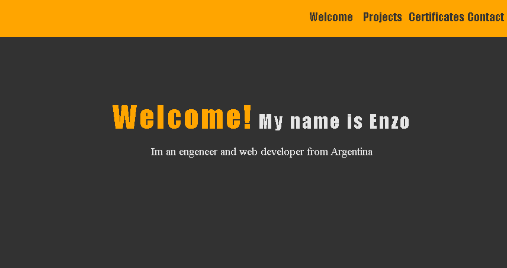

## Hi! I'm Enzo Weimann 👋

I'm from Argentina and I'm 28 years old

# 💫 About Me:
I'm looking for a Jr Java Developer job or Java bootcamp to improve my skills  
Currently taking an online full-stack  course taught by CEPIT (Tandil, Buenos Aires) 
Currently taking an online Java course in Udemy, including Spring framework and more 
I'm about to graduate as a civil engineer (great problem-solving skills, teamwork, and adaptation)

You can take a look at some of my projects in my portfolio: 

# 💻 Tech Stack:
          

# &#127891; Certificates:

# 📊 GitHub Stats:

## 🌐 Socials:
   

